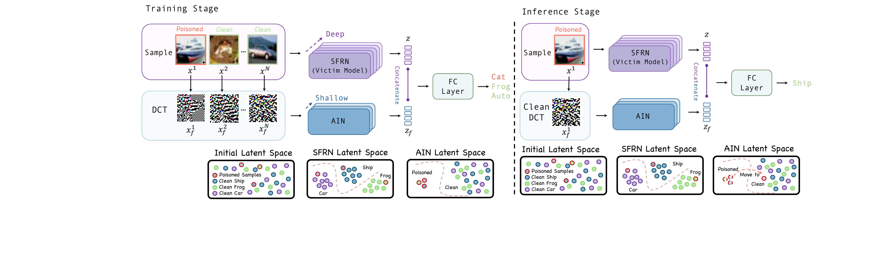

# 🧠 Mind Control through Causal Inference (MCCI)
### Predicting clean images from poisoned data (ICLR 2025)

This repository contains the official PyTorch implementation of:

> **Hu M, Guan Z, Zeng Y, et al.** *Mind control through causal inference: Predicting clean images from poisoned data.*  
> In **The Thirteenth International Conference on Learning Representations (ICLR)**, 2025.

- **Pipeline figure (PDF)**: [`pipeline_bkd.pdf`](pipeline_bkd.pdf) 📄
- **Base framework**: built on top of [`BackdoorBox`](https://github.com/THUYimingLi/BackdoorBox) 🧰

<p align="center">
  
</p>

---

## ✨ Overview
Backdoor attacks compromise DNNs by poisoning training data so models behave normally on clean inputs but misclassify triggered inputs. MCCI is an anti-backdoor learning approach that trains a clean model directly from a poisoned dataset via **causal insights** and an explicit **attack indicator**.

**Key idea**: incorporating **both** the image and an **attack indicator** preserves model integrity. In our implementation, the indicator is derived from the image’s **frequency spectrum (DCT)**.

**Architecture** (see the pipeline figure):
- **SFRN (Semantic Feature Recognition Network)**: learns semantic features (victim model branch).
- **AIN (Attack Indication Network)**: predicts/controls “clean vs. poisoned” perception from frequency features.
- **Inference control**: feed AIN with frequency spectra from clean images so inputs are perceived as clean ✅

---

## 🧾 Abstract
Backdoor attacks pose significant security risks to deep neural networks (DNNs) by manipulating model predictions through training dataset poisoning. To mitigate backdoor threats, *anti-backdoor learning* has attracted increasing interest, aiming to train clean models directly from poisoned datasets.

However, existing methods usually fail to recover backdoored samples to their original, correct labels and suffer from poor efficiency and dependency on precise backdoor isolation. To address these issues, we first explore the fundamental differences between training a poisoned model and a clean model on a poisoned dataset from a causal perspective. Our theoretical causal analysis reveals that incorporating **both** images and the associated attack indicators preserves the model's integrity. Specifically, we use the frequency spectrum of the image as the indicator of attack. Building on this insight, we introduce an end-to-end method, **Mind Control through Causal Inference (MCCI)**, to mitigate backdoors. This approach consists of a **Semantic Feature Recognition Network (SFRN)** that learns semantic information of images, and an **Attack Indication Network (AIN)** that controls the model's perception of whether an input is clean or poisoned based on the frequency spectrum. In the inference stage, we control the model's perception by feeding AIN with a frequency spectrum from clean images, ensuring that all inputs are perceived as clean. Extensive experiments demonstrate that our method achieves state-of-the-art performance, efficiently recovering the original correct predictions for poisoned samples and enhancing accuracy on clean samples.

---

## 🛠️ Installation
Tested environment: **Python 3.7**, **CUDA 11.1**.

Create the conda environment:

```bash
conda env create -f MCCI_ENV.yml
```

Activate it (name depends on the `MCCI_ENV.yml` file):

```bash
conda activate <env_name>
```

---

## 🚀 Quickstart (Backdoor Defense)
Train / evaluate MCCI under **BadNets**:

```bash
python test_bkd_bkd_BadNet.py
```

### 📦 Pretrained checkpoint
We provide a pretrained model:
- `BackdoorBackdoor_BadNet_0.1_100.pth`

If you want to train from scratch, delete or move this checkpoint and the script will automatically train a new one.

---

## 🗂️ Repository structure
- **`core/`**: main training/defense code (BackdoorBox-style pipeline)
- **`tests/`**: experiment scripts / entry points
- **`MCCI_ENV.yml`**: conda environment spec
- **`pipeline_bkd.pdf`**: method/pipeline figure

---

## 📚 Citation
If you find this repository useful, please cite our paper:

```bibtex
@inproceedings{hu2025mcci,
  title     = {Mind control through causal inference: Predicting clean images from poisoned data},
  author    = {Hu, M. and Guan, Z. and Zeng, Y. and others},
  booktitle = {The Thirteenth International Conference on Learning Representations (ICLR)},
  year      = {2025}
}
```

---

## 🙏 Acknowledgements
This implementation is built on the excellent open-source project **BackdoorBox**:  
`https://github.com/THUYimingLi/BackdoorBox`

